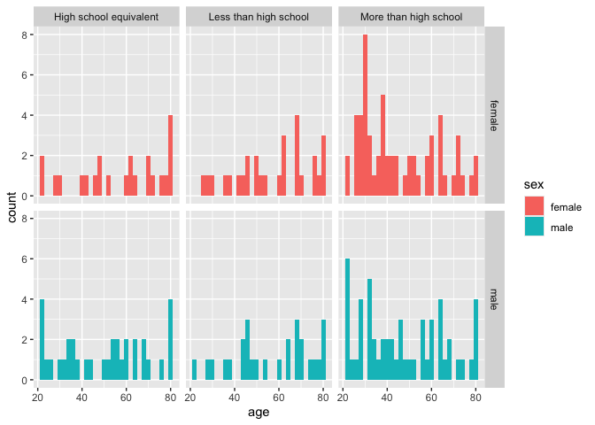

p8105_hw3_ml5222
================
Miriam Lachs
2024-10-09

Load packages

    ## ── Attaching core tidyverse packages ──────────────────────── tidyverse 2.0.0 ──
    ## ✔ dplyr     1.1.4     ✔ readr     2.1.5
    ## ✔ forcats   1.0.0     ✔ stringr   1.5.1
    ## ✔ ggplot2   3.5.1     ✔ tibble    3.2.1
    ## ✔ lubridate 1.9.3     ✔ tidyr     1.3.1
    ## ✔ purrr     1.0.2     
    ## ── Conflicts ────────────────────────────────────────── tidyverse_conflicts() ──
    ## ✖ dplyr::filter() masks stats::filter()
    ## ✖ dplyr::lag()    masks stats::lag()
    ## ℹ Use the conflicted package (<http://conflicted.r-lib.org/>) to force all conflicts to become errors

## Problem 1

Load data

clean the data

``` r
ny_noaa=
  ny_noaa %>% 
  mutate(
    day=day(date),
    month=month(date),
    year=year(date),
    prcp=prcp/10,
    tmax=as.numeric(tmax)/10,
    tmin=as.numeric(tmin)/10)
```

``` r
ny_noaa %>% 
  ggplot(aes(x=snow))+geom_boxplot()
```

    ## Warning: Removed 381221 rows containing non-finite outside the scale range
    ## (`stat_boxplot()`).

<!-- -->

``` r
ny_noaa %>% 
  summarise(min_snow=min(snow,na.rm =TRUE))
```

    ## # A tibble: 1 × 1
    ##   min_snow
    ##      <int>
    ## 1      -13

## Problem 2

Import, clean and join the data

``` r
NHANES_dem=
  read_csv('nhanes_covar.csv',skip=4) %>% 
  janitor::clean_names()
```

    ## Rows: 250 Columns: 5
    ## ── Column specification ────────────────────────────────────────────────────────
    ## Delimiter: ","
    ## dbl (5): SEQN, sex, age, BMI, education
    ## 
    ## ℹ Use `spec()` to retrieve the full column specification for this data.
    ## ℹ Specify the column types or set `show_col_types = FALSE` to quiet this message.

``` r
NHANES_acc=read_csv('nhanes_accel.csv') %>% 
  janitor::clean_names()
```

    ## Rows: 250 Columns: 1441
    ## ── Column specification ────────────────────────────────────────────────────────
    ## Delimiter: ","
    ## dbl (1441): SEQN, min1, min2, min3, min4, min5, min6, min7, min8, min9, min1...
    ## 
    ## ℹ Use `spec()` to retrieve the full column specification for this data.
    ## ℹ Specify the column types or set `show_col_types = FALSE` to quiet this message.

``` r
NHANES_full=
  NHANES_dem %>% 
  left_join(NHANES_acc,'seqn') %>% 
  filter(age>21) %>% 
  drop_na(,c(sex,age,bmi,education)) %>% 
  mutate(
    sex=as.factor(ifelse(sex==1,'male','female')),
    education=as.factor(case_match(education, 1~'Less than high school',2~'High school equivalent',3~'More than high school'))
         )
```

Produce a reader-friendly tables for count information

``` r
NHANES_full %>% 
  select(sex,education,age) %>% 
  group_by(sex,education) %>% 
  count() %>% 
  pivot_wider(names_from = sex,values_from = n)
```

    ## # A tibble: 3 × 3
    ## # Groups:   education [3]
    ##   education              female  male
    ##   <fct>                   <int> <int>
    ## 1 High school equivalent     23    34
    ## 2 Less than high school      28    27
    ## 3 More than high school      59    54

Plot age distributions for men and women in each education category

``` r
NHANES_full %>% 
  ggplot(aes(x=age,fill = sex))+geom_histogram()+facet_grid(sex~education)
```

    ## `stat_bin()` using `bins = 30`. Pick better value with `binwidth`.

<!-- -->

Based on these distributions, there doesn’t seem to be much difference
in the distributions between gender. For participants who have more then
high school level education, participation is higher for younger
participants. While there seems to be more uniform distribution across
the other education levels with slightly more older participants.

Looking at total activity

``` r
NHANES_full %>% 
  mutate(total_activity=select(., min1:min1440) %>% rowSums(na.rm = TRUE)) %>% 
  select(seqn,sex,age,education,total_activity) %>% 
  ggplot(aes(x=age,y=total_activity,colour = sex))+geom_point()+facet_grid(~education)+geom_smooth(se=FALSE)
```

    ## `geom_smooth()` using method = 'loess' and formula = 'y ~ x'

<!-- -->

Based on these plots we can see that activity tends to decrease as age
increases. We also can see that for those with a high school equivalent
education or above, women tend to be more active then men. Even with
these trends we can see that activity is pretty widely distributed.

Plot across the day

``` r
NHANES_full %>% 
  mutate(T00=select(., min1:min60) %>% rowSums(na.rm = TRUE),
         T01=select(., min61:min120) %>% rowSums(na.rm = TRUE),
         T02=select(., min121:min180) %>% rowSums(na.rm = TRUE),
         T03=select(., min181:min240) %>% rowSums(na.rm = TRUE),
         T04=select(., min241:min300) %>% rowSums(na.rm = TRUE),
         T05=select(., min301:min360) %>% rowSums(na.rm = TRUE),
         T06=select(., min361:min420) %>% rowSums(na.rm = TRUE),
         T07=select(., min421:min480) %>% rowSums(na.rm = TRUE),
         T08=select(., min481:min540) %>% rowSums(na.rm = TRUE),
         T09=select(., min541:min600) %>% rowSums(na.rm = TRUE),
         T10=select(., min601:min660) %>% rowSums(na.rm = TRUE),
         T11=select(., min661:min720) %>% rowSums(na.rm = TRUE),
         T12=select(., min721:min780) %>% rowSums(na.rm = TRUE),
         T13=select(., min781:min840) %>% rowSums(na.rm = TRUE),
         T14=select(., min841:min900) %>% rowSums(na.rm = TRUE),
         T15=select(., min901:min960) %>% rowSums(na.rm = TRUE),
         T16=select(., min961:min1020) %>% rowSums(na.rm = TRUE),
         T17=select(., min1021:min1080) %>% rowSums(na.rm = TRUE),
         T18=select(., min1081:min1140) %>% rowSums(na.rm = TRUE),
         T19=select(., min1141:min1200) %>% rowSums(na.rm = TRUE),
         T20=select(., min1201:min1260) %>% rowSums(na.rm = TRUE),
         T21=select(., min1261:min1320) %>% rowSums(na.rm = TRUE),
         T22=select(., min1321:min1380) %>% rowSums(na.rm = TRUE),
         T23=select(., min1381:min1440) %>% rowSums(na.rm = TRUE)
         ) %>% 
  pivot_longer(cols = T00:T23,values_to = 'activity',names_to = 'hour') %>% 
  select(sex,age,bmi,education,hour,activity) %>% 
  ggplot(aes(x=hour,y=activity, colour = sex))+geom_point()+facet_grid(~education)+labs(
    title = " Hourly Activity",
    x = "Hour)",
    y = "Activity",
    color = "Sex"  )+ theme(axis.text.x = element_text(angle = 90, vjust = 0.5, hjust=1))
```

<!-- -->

Based on this graph we can make conclusions about when people are most
and least active. It seems that people are least active in the middle of
the night/ early hours of the morning. Activity rises until about mid
day where it starts to decline again. We can also see some outliers of
people who were particularly active late in the evening.
